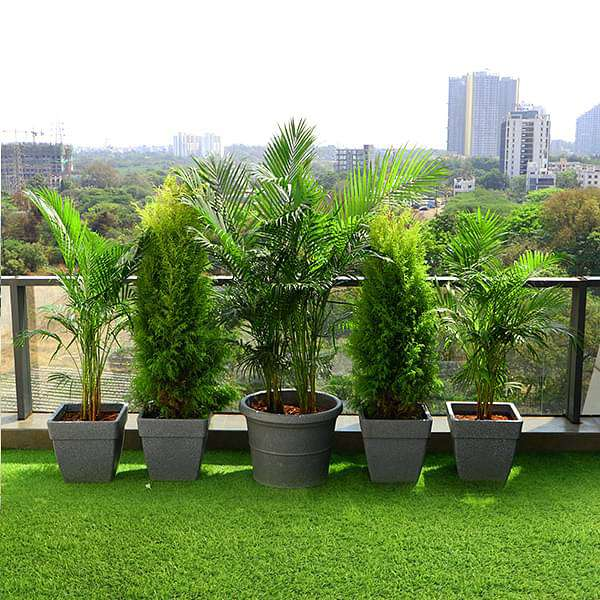

# FREINDLY HOUSEHOLD PLANTS🪴🪴🪴
## Welcome to the page of household plants ##
In this page ,I Add 5 plants named as :
* 1. Golden pothos *
* 2. Snake plant * 
* 3. ZZ plant *
* 4. Spider plant *
* 5. Heartleaf Philodendron *
 
To get a proper information,I described each plants in three points
that compare plants and easy to understand that which type of plant 
are suitable according to customer's need.

** The points are :** 
- Description
- Best for
- Light/Water
  
 For every plant these three points are important:
 1. Description:This describes the plants age,color and its features.
 2. Best for:This describes the plant's ability and its main features.
 3. Light/Water:This describes how much water and light the plant to be neede for proper growth.
   
    ()

    
   "Every gardener is a storyteller; every plant is a chapter."